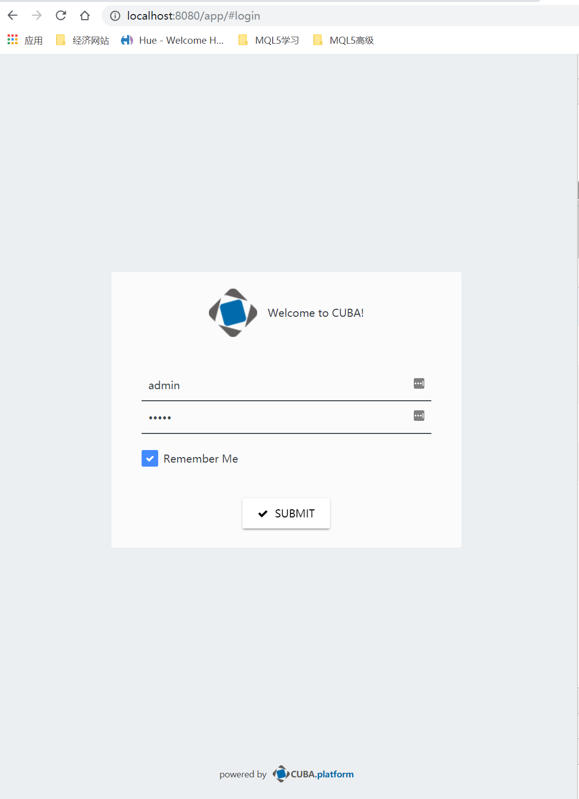
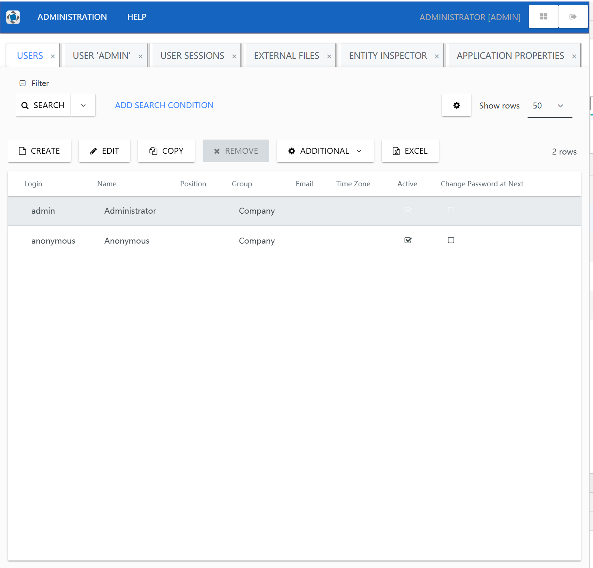
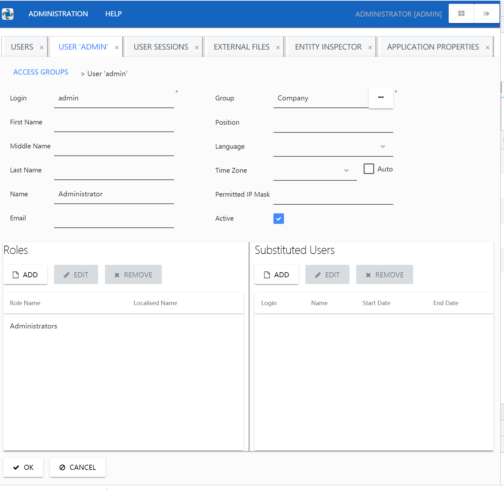
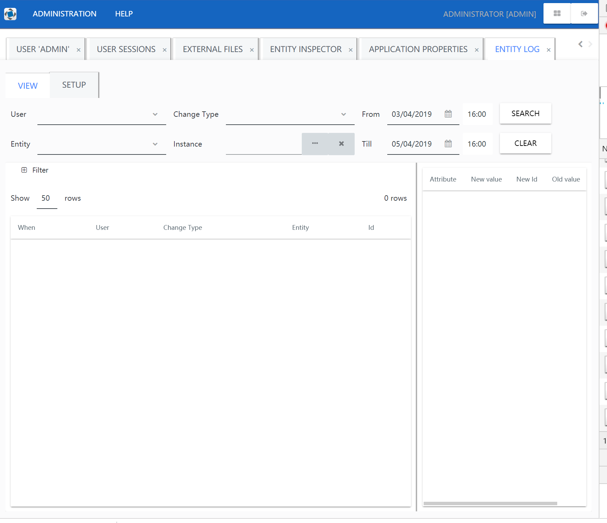

## cuba-platform material theme

migrate from  [appreciated/material](https://github.com/appreciated/material)


### How to install

#### modify *build.gradle*
* add jitpack.io to repositories
```$groovy
   repositories {
        maven {
            url 'https://dl.bintray.com/cuba-platform/main'
        }
        maven { url 'https://jitpack.io' } // <-add
        jcenter()
    }
```
* add  com.github.chenjiajia:material:0.2.4 to webModule config
```$groovy
configure(webModule) {
    configurations {
        webcontent
    }

    dependencies {
        compileOnly(servletApi)
        compile(globalModule)
        compile('com.github.chenjiajia:material:0.2.4') // <-add
        themes('com.github.chenjiajia:material:0.2.4') //<- add
    }
```   
#### create theme extension and modify to extend material theme
* Create Theme Extension and modify dir name to material
* modify styles.scss
```$scss
@import "material.scss";  // <- change first line 
@import "you.packge.names/halo-ext-defaults";
@import "app-components";
@import "you.packge.names/halo-ext";

.material {     // <-change to 
  @include material; // <-change to
}
```   
#### modify web-app.properties
```$text
 cuba.web.theme = material
 cuba.themeConfig= /material/material-theme.properties com/haulmont/cuba/havana-theme.properties com/haulmont/cuba/halo-theme.properties com/haulmont/cuba/hover-theme.properties

```
### gallery






